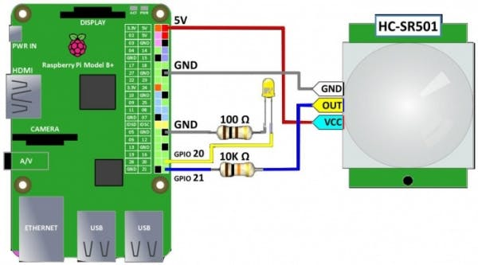

# Software-Hardware_Lab
This lab is for getting students familiar with Python, andconnecting hardware to software with the Raspberry Pi.

## Learning Objectives
- Basic understanding of Python Syntax
- Connect Hardware to Software with GPIO pins
- Basic electrical wiring
- Motion detection
- Raspberry Pi Python GPIO module

### Schematic

